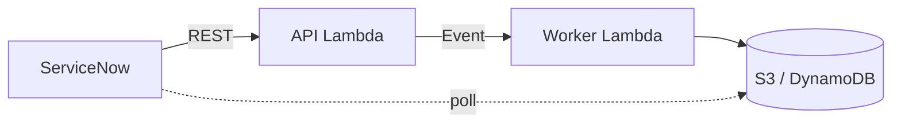

# 確認支援 設計（最優先機能）

ServiceNow の確認ワークフローから REST で呼ばれ、添付 Excel の各回答を RAG で確認し、**判定・返答案・根拠**を Excel に追記して返却する。**画面は持たない（ヘッドレス）**。

## 1. 処理シーケンス



1. ServiceNow が Excel を S3 にアップロード（presigned PUT）。
2. `POST /v1/reviews` でジョブ作成。API Lambda が DynamoDB にジョブ登録 → Worker を非同期起動 → `202 { job_id }`。
3. Worker が Excel 解析 → 各回答を RAG + Bedrock で評価 → Excel 追記 → S3 出力 → ジョブ完了。
4. ServiceNow がポーリングで完了検知 → 結果 Excel を取得。

詳細な I/F は [servicenow-integration.md](servicenow-integration.md)。

## 2. Worker の処理パイプライン

```python
def handle_review_job(job):
    wb = load_excel(s3_get(job.s3_key))          # openpyxl
    qa_rows = extract_qa(wb, layout=job.layout)  # 質問ID/質問文/回答 を抽出
    results = []
    for row in qa_rows:
        kws = extract_keywords(row.question, row.answer)   # AI or ルール
        kws = pii_filter(kws)                              # PII 除去（必須）
        retrieved = retrieve(strategy_id, RetrievalQuery(  # RAG
            question=row, keywords=kws, top_k=5))
        verdict = bedrock_review(row, retrieved, model_id) # 判定+返答案+根拠
        results.append(verdict)
        update_progress(job, done=len(results), total=len(qa_rows))
    out_wb = append_results(wb, qa_rows, results)          # Excel 追記
    out_key = s3_put(serialize(out_wb), outbound_key(job))
    complete_job(job, out_key, summarize(results))
```

## 3. AI 出力スキーマ（1 回答あたり）

Bedrock からは JSON のみを返させ、postprocess で検証する。

```jsonc
{
  "question_id": "Q-012",
  "verdict": "approved | conditional | needs_review | rejected",
  "reply_draft": "確認者が ServiceNow にそのまま転記できる返答文（日本語）",
  "rationale": "判定の根拠（どの参考情報/過去事例に基づくか）",
  "references": [
    { "type": "reference | past_case | synthetic", "title": "...", "source_id": "..." }
  ],
  "confidence": "high | medium | low"
}
```

判定基準は application-form-poc の方針を踏襲（**実リスク焦点**、ベストプラクティス完全一致は求めない）。詳細は [rag-architecture.md](rag-architecture.md#プロンプト方針)。

## 4. Excel フォーマット規約

### 4.1 入力（ServiceNow から受領）

最低限、以下を機械的に特定できること。マッピングは `job.layout`（デフォルト + 申請単位で上書き可）で指定。

| 論理項目 | 既定の特定方法 | 必須 |
|---|---|---|
| 質問 ID | ヘッダ行に `質問ID` / `Q_ID` 等、なければ行番号で代替 | △ |
| 質問文 | ヘッダ行に `質問` / `Question` / `項目` | ◯ |
| 回答 | ヘッダ行に `回答` / `Answer` | ◯ |
| カテゴリ | ヘッダ行に `カテゴリ` 等（任意） | — |

> 顧客ごとにフォーマットが揺れる場合は、入力支援 v2 と同じ **AI による列マッピング解釈**（[input-assistance.md](input-assistance.md)）を流用可能。確認支援 POC では「規約に沿った Excel」を前提に開始し、揺らぎ対応は後続で追加。

### 4.2 出力（ServiceNow へ返却）

元の Excel を保持したまま、AI 追記列を**右側に付与**（既存セルは壊さない）。

| 追記列 | 内容 |
|---|---|
| `AI判定` | approved / conditional / needs_review / rejected（日本語ラベル） |
| `AI返答案` | 確認者が転記できる返答文 |
| `AI根拠` | 判定根拠の要約 |
| `AI参照` | 参照した参考情報/過去事例のタイトル |
| `AI信頼度` | high / medium / low |

別案として「サマリーシート」を 1 枚追加し、全体所見（approved 件数等）を記載。

## 5. ジョブ管理（DynamoDB）

```jsonc
{
  "job_id": "REV-20260605-abc123",   // PK
  "kind": "review",                  // review | input_assist
  "sn_record_id": "REQ0012345",
  "status": "processing | completed | failed",
  "s3_key_in": "reviews/inbound/.../uuid.xlsx",
  "s3_key_out": "reviews/outbound/.../uuid_reviewed.xlsx",
  "model_id": "claude-sonnet-4-6",
  "retrieval_strategy_id": "hybrid",
  "progress": { "current": 12, "total": 30 },
  "summary": { "approved": 22, "conditional": 5, "needs_review": 3, "rejected": 0 },
  "error": null,
  "created_at": "...",
  "completed_at": "...",
  "ttl": 1234567890                  // 7 日後自動削除
}
```

## 6. エラーハンドリング

| 事象 | 対応 |
|---|---|
| Excel 解析不能（規約不一致） | `status=failed`, error にどの列が見つからないか明示。ServiceNow に返す。 |
| 一部の質問で Bedrock 失敗 | その行は `needs_review` + エラー注記でスキップ継続（全体は止めない）。 |
| RAG 失敗 | 参考情報なしで AI 単体評価にフォールバック（信頼度 low）。 |
| Worker タイムアウト（300秒超） | 質問を分割しチャンク処理 or Step Functions 化（後続検討）。 |

## 7. 段階実装

| ステップ | 内容 | 状態 |
|---|---|---|
| C1 | REST I/F + S3 presigned + ジョブ管理（DynamoDB）+ ダミー Worker（Excel 素通り） | ✅ 実装済 |
| C2 | Excel 解析（openpyxl）+ Q&A 抽出 + 判定列の追記書き戻し（判定は reviewer スタブ） | ✅ 実装済 |
| C3 | RAG retrieve（まず fulltext）+ Bedrock 評価 + 出力スキーマ（reviewer 差し替え） | 次 |
| C4 | PII フィルタ・進捗・サマリー・エラー処理 | — |
| C5 | retrieval 戦略切替（Bedrock KB / corpus2skill）対応 | — |

> **C2 の実装メモ**: Excel 入出力は [`backend/src/services/excel_io.py`](../../backend/src/services/excel_io.py)（ヘッダ別名での列特定・空行スキップ・右側への AI 列追記）。判定は [`backend/src/services/reviewer.py`](../../backend/src/services/reviewer.py) の `review_answer()`（C2 はスタブ、C3 で RAG + Bedrock に差し替え。**インターフェースは維持**）。見本出力: [`doc/samples/sample-application-reviewed.xlsx`](../samples/sample-application-reviewed.xlsx)。

## 8. 関連

- [ServiceNow 連携設計](servicenow-integration.md)
- [RAG アーキテクチャ](rag-architecture.md)
- [ADR-002 Excel 受け渡し](../adr/002-excel-exchange-method.md) / [ADR-003 非同期処理](../adr/003-async-processing.md)
