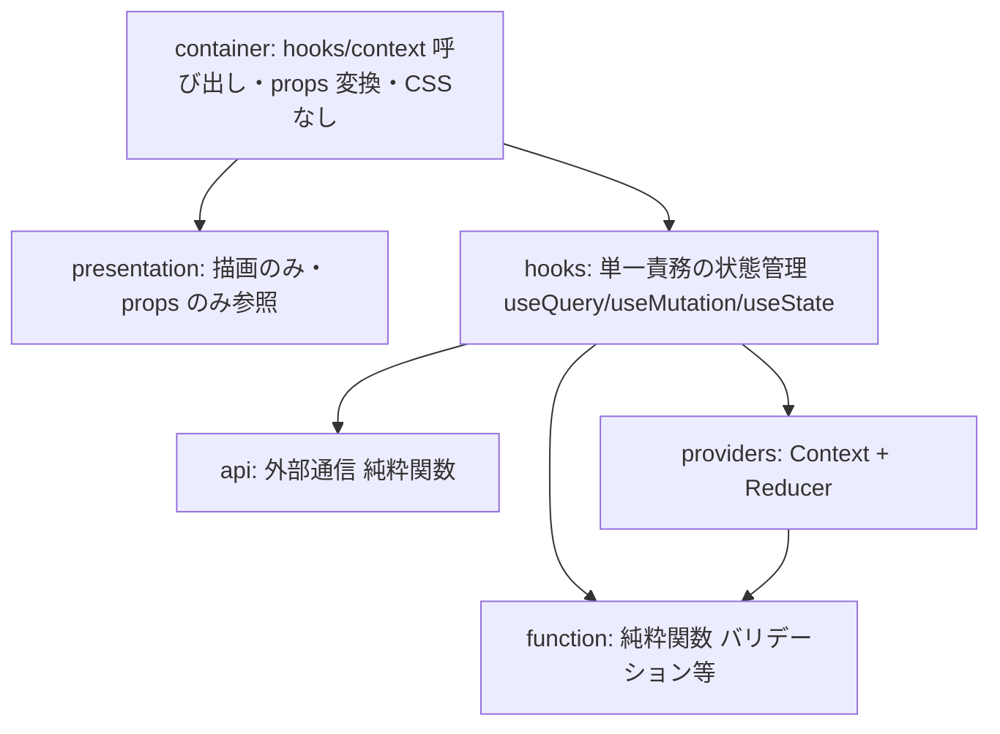
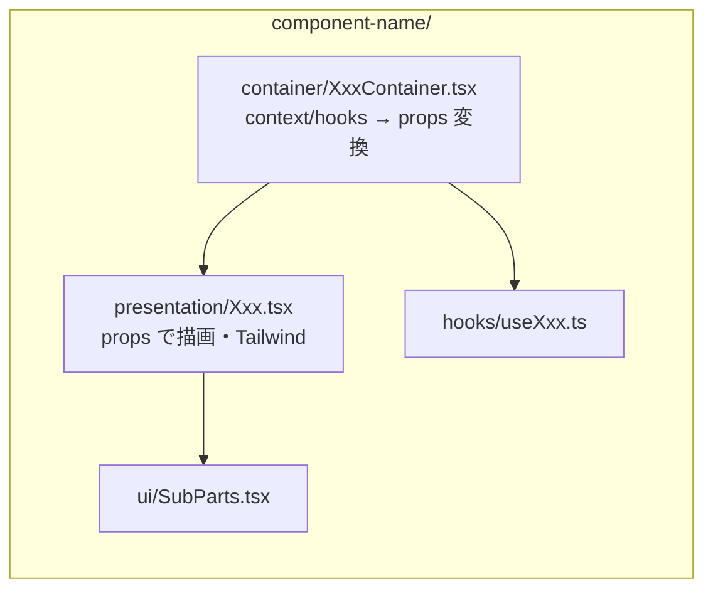

# フロントエンド設計

入力支援 SPA と AI チューニング画面を対象とする React + TypeScript + Vite の設計。application-form-poc のレイヤー設計・Container/Presentation パターン・モックファースト開発を踏襲する。

## 1. 技術スタック

| 項目 | 採用 |
|---|---|
| フレームワーク | React 18 + TypeScript |
| ビルド/開発 | Vite |
| サーバー状態 | React Query (@tanstack/react-query) |
| クライアント状態 | React Context + useReducer / useState |
| スタイリング | Tailwind CSS v4 |
| ルーティング | React Router（遅延読み込み + Suspense） |
| 認証 | Amazon Cognito（SRP） |
| ホスティング | CloudFront + S3 |

## 2. レイヤー構成と依存方向



**ルール**
- **Hooks 同士は直接呼ばない** — container が調整役。
- **Container は CSS を書かない** — props 変換と状態取得に専念。
- **Presentation は props だけ** — state/hooks/Context を直接参照しない。
- **コロケーション** — まずコンポーネント内に置き、2 箇所以上で使うなら feature 共通へ、複数 feature で使うなら `shared/` へ昇格。

## 3. フォルダ構成（本プロジェクト向け）

```
frontend/src/
├── app/                       # App.tsx, routes.tsx
├── pages/                     # レイアウト専用（ロジックなし）
│   ├── login-page/
│   ├── input-assist-new-page/        # 入力支援: アップロード
│   ├── input-assist-detail-page/     # 入力支援: 回答案表示・編集・Excel出力
│   └── admin/                        # AI チューニング各画面
│       ├── admin-dashboard-page/
│       ├── admin-references-page/
│       ├── admin-retrieval-page/
│       └── admin-evaluation-page/
├── features/                  # 機能モジュール
│   ├── auth/                  # Cognito 認証
│   ├── input-assist/          # 入力支援
│   │   ├── components/
│   │   │   ├── upload-form/          # container/ presentation/ ui/ hooks/
│   │   │   ├── answer-suggestion-list/
│   │   │   └── excel-export/
│   │   ├── providers/InputAssistProvider.tsx
│   │   ├── api/input-assist-api.ts
│   │   └── types/input-assist.types.ts
│   └── admin/                 # AI チューニング
│       ├── components/
│       │   ├── reference-management/
│       │   ├── synthetic-case-editor/
│       │   ├── retrieval-settings/
│       │   └── evaluation-comparison/   # モデル×戦略 比較ビュー
│       ├── api/admin-api.ts
│       └── types/admin.types.ts
├── shared/
│   ├── components/            # loading/ status-badge/ evaluation-badge/ pagination/
│   ├── providers/            # AppProvider, QueryProvider, AuthProvider
│   ├── hooks/                # useAuth, useToast
│   ├── api/                  # api-client.ts, cognito-client.ts
│   ├── types/                # api.types.ts, domain.types.ts
│   ├── config/               # api-config.ts
│   ├── mocks/                # モックデータ/ハンドラ
│   └── lib/
├── layouts/                   # AppLayout
└── routes/                    # PrivateRoute, RoleBasedRoute
```

各コンポーネントは `container/ + presentation/`（1:1）+ 任意の `ui/`・`hooks/` で構成（[ADR-006](../adr/006-frontend-container-presentation.md)）。

## 4. Container/Presentation パターン



| レイヤー | CSS 責務 |
|---|---|
| Page / Section | マクロレイアウト（`grid gap-6`, `space-y-6`） |
| Presentation | 見た目（`bg-white rounded-xl border shadow-sm p-4`） |
| Container | なし |

## 5. 状態管理

| 状態 | 管理 |
|---|---|
| サーバー状態 | React Query（API 層は純粋関数、hooks で useQuery/useMutation ラップ） |
| グローバル（認証・テーマ） | Context + Reducer（shared/providers） |
| 画面複合状態 | feature provider。大規模画面は **Data / Selection / Actions の 3 Context に分割**して再レンダリング最小化 |
| ローカル UI | useState |

## 6. API 通信と認証

- `shared/api/api-client.ts` に共通クライアント（`VITE_API_BASE_URL`、Bearer トークン付与、`cache: 'no-store'`）。
- 認証は Cognito SRP（`features/auth/api/cognito-client.ts`）。`PrivateRoute` / `RoleBasedRoute`（admin）でガード。
- **本 SPA の API は HTTP API + Cognito JWT 認証**（`/api/*`）。ServiceNow 用の APIキー系（`/v1/*`）とは別系統（[ADR-004](../adr/004-api-auth-apikey.md)）。

## 7. モックファースト開発

バックエンド未完でもフロントを先行開発する。

```bash
# .env.development
VITE_USE_MOCK=true
VITE_MOCK_AUTH=true
VITE_API_BASE_URL=http://localhost:3000
```

- `VITE_USE_MOCK=true` で API 層がモックデータを返す（msw or 分岐）。
- `VITE_MOCK_AUTH=true` で Cognito をバイパスし固定ユーザーでログイン。
- 実 API 切替は env 変更のみ（`make fe-env` で terraform output から `.env` 生成）。

## 8. ローディング表現

`shared/components/loading/Loading.tsx` の variant で統一。

| variant | 待機 | 用途 |
|---|---|---|
| inline | <1s | プレビュー取得 |
| block | 1-5s | コンポーネント内 |
| page / screen | 1-5s | ページ/全体 |
| progress | >5s | AI 分析（回答案生成）の進捗率表示 |

入力支援の回答案生成は非同期ジョブ（ポーリング）になるため、`progress` で進捗を表示する。

## 9. 画面一覧

| ルート | 役割 | ロール |
|---|---|---|
| `/login` | ログイン | 全 |
| `/input-assist/new` | Excel + 案件概要アップロード | applicant |
| `/input-assist/:jobId` | 回答案・根拠表示 / WEB 編集 / Excel 出力 | applicant |
| `/admin` | チューニング ダッシュボード | admin |
| `/admin/references` | 参考情報・合成事例・キュレーション | admin |
| `/admin/retrieval` | retrieval 戦略・同期状態 | admin |
| `/admin/evaluation` | モデル×戦略 精度比較 | admin |

## 10. 関連

- [ADR-006 Container/Presentation パターン](../adr/006-frontend-container-presentation.md)
- [入力支援設計](input-assistance.md) / [AI チューニング設計](admin-tuning.md)
- 母体: `../application-form-poc/doc/design/frontend/`
