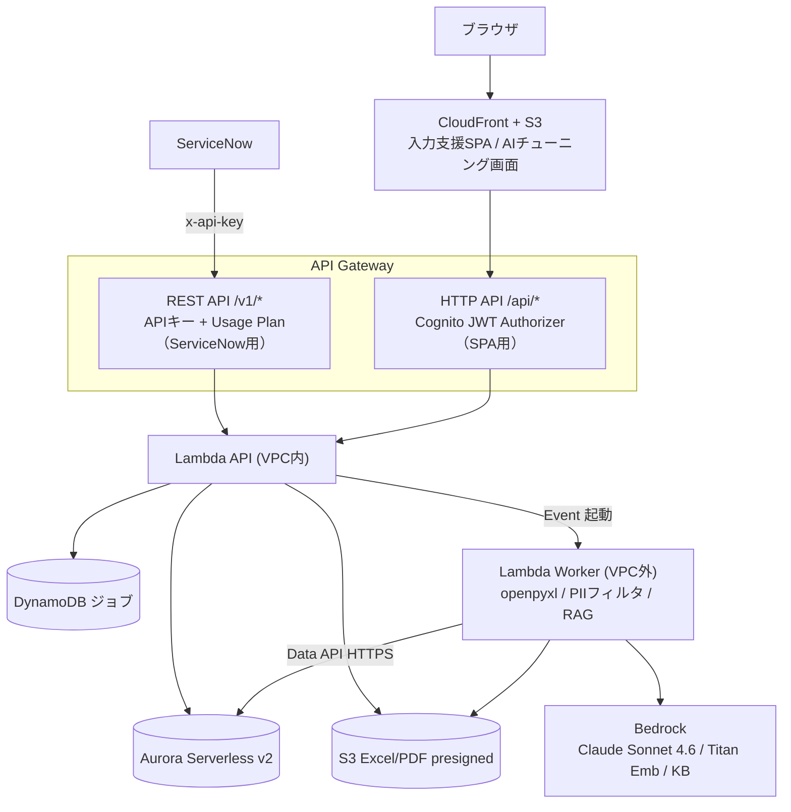

# インフラ設計

application-form-poc の構成を踏襲。Terraform モジュール構成、`terraform destroy` で完全削除可能を維持。

## 1. 構成



## 2. AWS サービス

| 層 | サービス | 備考 |
|---|---|---|
| 連携入口 | API Gateway REST API | ServiceNow 用 `/v1/*`、API Key + Usage Plan |
| SPA 入口 | API Gateway HTTP API | SPA 用 `/api/*`、Cognito JWT Authorizer |
| 配信 | CloudFront + S3（OAC） | SPA ホスティング |
| 認証 | Cognito | SPA ユーザー（applicant / admin）。ServiceNow は APIキー |
| 実行 | Lambda API（VPC内, 512MB/120s）/ Worker（VPC外, 512MB/300s）/ Authorizer | Python 3.12 |
| DB | Aurora Serverless v2 (MySQL 8.0) | API=pymysql, Worker=Data API |
| ジョブ | DynamoDB (PAY_PER_REQUEST, TTL 7日) | review / input_assist ジョブ |
| ストレージ | S3 | Excel 入出力、PDF、corpus-skill/v* |
| LLM | Bedrock | Claude Sonnet 4.6（ap-northeast-1, jp. プロファイル） |
| Vector | Bedrock KB + OpenSearch Serverless | `bedrock_kb` 戦略時のみ（コスト ~$170-200/月） |
| 機密 | Secrets Manager | DB 認証情報・APIキー・Tavily key |

## 3. ネットワーク

- VPC `10.0.0.0/16`、Private Subnet 2 AZ。
- VPC Endpoint（Interface: logs/sts/secretsmanager/lambda、Gateway: s3/dynamodb）。**NAT Gateway 不使用**。
- Worker は VPC 外（Bedrock マルチリージョン呼び出しと Data API のため）。

## 4. Terraform モジュール（予定）

```
infra/terraform/
├── modules/
│   ├── network/        # VPC, Subnet, VPC Endpoints, SG
│   ├── apigw-rest/     # ServiceNow 用 REST API + API Key + Usage Plan
│   ├── apigw-http/     # SPA 用 HTTP API + Cognito Authorizer
│   ├── lambda/         # API + Worker + Authorizer
│   ├── aurora/         # Serverless v2 (MySQL 8.0)
│   ├── dynamodb/       # ジョブテーブル
│   ├── s3/             # SPA バケット + Excel バケット
│   ├── cloudfront/     # Distribution + OAC
│   ├── cognito/        # User Pool（SPA）
│   └── bedrock-kb/     # KB + OpenSearch Serverless（任意, 戦略次第）
└── environments/dev/
```

## 5. application-form-poc との差分

| 項目 | application-form-poc | aws-rag-poc |
|---|---|---|
| 業務主体 | AWS（フルワークフロー） | ServiceNow |
| 外部連携入口 | なし | **ServiceNow REST（APIキー）** |
| 主軸モデル | Foundation-Sec | **Claude Sonnet 4.6** |
| 画面 | applicant/reviewer/admin 全部 | 入力支援 + AI チューニングのみ |
| Excel | 質問マスタ取り込み | **申請書の入出力**（確認/入力支援） |

## 6. Destroy 対応

S3 `force_destroy=true`、CloudFront `retain_on_delete=false`、Cognito `deletion_protection=INACTIVE`、Log Group `skip_destroy=false`。OpenSearch Serverless を使う場合は削除順序・コストに注意。
