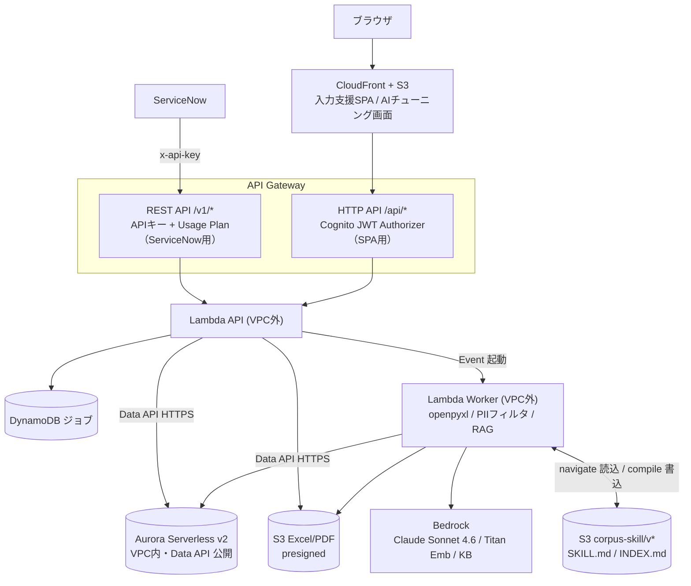

# インフラ設計

application-form-poc の構成を踏襲。Terraform モジュール構成、`terraform destroy` で完全削除可能を維持。

## 1. 構成



## 2. AWS サービス

| 層 | サービス | 備考 |
|---|---|---|
| 連携入口 | API Gateway REST API | ServiceNow 用 `/v1/*`、API Key + Usage Plan |
| SPA 入口 | API Gateway HTTP API | SPA 用 `/api/*`、Cognito JWT Authorizer |
| 配信 | CloudFront + S3（OAC） | SPA ホスティング |
| 認証 | Cognito | SPA ユーザー（applicant / admin）。ServiceNow は APIキー |
| 実行 | Lambda API（**VPC外**, 512MB/30s）/ Worker（**VPC外**, 512MB/300s）/ Authorizer（SPA用, 後続） | Python 3.12。両 Lambda とも VPC 外 |
| DB | Aurora Serverless v2 (MySQL 8.0) | **API/Worker とも Data API (HTTPS)** で接続（VPC 外から）。Phase 2 で導入 |
| ジョブ | DynamoDB (PAY_PER_REQUEST, TTL 7日) | review / input_assist ジョブ |
| ストレージ | S3（用途別に複数バケット） | ① SPA 配信、② Excel/PDF 入出力（presigned・PII含む・短命）、③ corpus-skill/v*（SKILL.md/INDEX.md・世代保持） |
| LLM | Bedrock | Claude Sonnet 4.6（ap-northeast-1, jp. プロファイル） |
| Vector | Bedrock KB + OpenSearch Serverless | `bedrock_kb` 戦略時のみ（コスト ~$170-200/月） |
| 機密 | Secrets Manager | DB 認証情報・APIキー・Tavily key |

## 3. ネットワーク

- **Lambda は API / Worker とも VPC 外**（[ADR-007](../adr/007-lambda-outside-vpc.md)）。
  - 到達先はすべて公開エンドポイント: S3 / DynamoDB / Bedrock / Aurora **Data API**（いずれも HTTPS）。
  - VPC アタッチ・NAT Gateway・Interface/Gateway Endpoint は **不要**。ENI 作成によるコールドスタート増も回避。
- **VPC `10.0.0.0/16` + Private Subnet 2 AZ は Aurora 専用**（Phase 2 で Aurora 導入時に使用）。Aurora クラスタはサブネット必須のため VPC 内に置くが、Lambda からは Data API（公開 HTTPS エンドポイント）で接続するため VPC 越境は発生しない。
- 現状（C1〜C3）は Aurora 未導入のため、network モジュールは将来用の土台。

## 4. Terraform モジュール（予定）

```
infra/terraform/
├── modules/
│   ├── network/        # VPC, Subnet（Aurora 専用・Phase 2。Lambda は VPC 外）
│   ├── apigw-rest/     # ServiceNow 用 REST API + API Key + Usage Plan
│   ├── apigw-http/     # SPA 用 HTTP API + Cognito Authorizer
│   ├── lambda/         # API + Worker + Authorizer
│   ├── aurora/         # Serverless v2 (MySQL 8.0)
│   ├── dynamodb/       # ジョブテーブル
│   ├── s3/             # SPA / Excel(PII・短命) / corpus-skill(世代保持) の3バケット
│   ├── cloudfront/     # Distribution + OAC
│   ├── cognito/        # User Pool（SPA）
│   └── bedrock-kb/     # KB + OpenSearch Serverless（任意, 戦略次第）
└── environments/dev/
```

## 5. Bedrock の処理

Worker（VPC 外）から Amazon Bedrock を呼ぶ。Bedrock は **AWS 信頼境界内**で完結し、プロンプト・出力は Anthropic/OpenAI には届かない。評価系は `temperature=0` / JSON 出力。

| # | 処理 | API・モデル | 入力 | 出力 | 状態 |
|---|---|---|---|---|---|
| 1 | **回答評価**（確認支援・入力支援） | Converse / Claude Sonnet 4.6 | system + REFERENCE_CONTEXT（retrieve 結果）+ 質問/回答 | JSON: `verdict` / `reply_draft` / `rationale` / `confidence` | ✅ C3 実装済 |
| 2 | **回答案生成 + 案件概要の解釈**（入力支援） | Converse / Claude（マルチモーダル, 画像入力） | 質問 + 案件概要（text/画像）+ RAG | 回答案 + 根拠 | Phase 3 |
| 3 | キーワード抽出（retrieve 前） | Converse / Claude | 質問/回答（PII 除去後） | 検索キーワード | 任意（現 `fulltext` は substring 一致で未使用） |
| 4 | 埋め込み生成 | **Titan Embeddings V2** | 文書 / クエリ | ベクトル | C5（`bedrock_kb` / `corpus2skill`） |
| 5 | corpus2skill のクラスタ要約 / navigate | Converse / Claude（tool use） | クラスタ文書 / SKILL ツリー | 要約・ノード選択 | C5 |
| 6 | 参考情報の AI リフレッシュ・取り込み要約（admin） | Converse / Claude | URL/PDF 本文 | title / summary / keywords 提案 | Phase 2 |

処理 1 の実装は [`providers/claude_bedrock.py`](../../backend/src/services/providers/claude_bedrock.py) + [`prompt.py`](../../backend/src/services/prompt.py) + [`postprocess.py`](../../backend/src/services/postprocess.py)。詳細は [RAG アーキテクチャ](rag-architecture.md)。

## 6. データ（DynamoDB / Aurora / S3）

各ストアに入るデータの一覧は [データモデル](data-model.md) を参照。要点:

- **DynamoDB**（実装済）= 確認支援ジョブのメタデータ・進捗・集計のみ（Excel 本文や回答テキストは持たない）。
- **Aurora**（Phase 2）= RAG の知識源（参考情報・過去事例・合成事例）と運用データ（精度比較・設定）。API/Worker とも **Data API (HTTPS)** で接続。
- **S3** = 入出力 Excel（PII 含みうる・短命）、将来 corpus-skill / SPA 資産。

## 7. application-form-poc との差分

| 項目 | application-form-poc | aws-rag-poc |
|---|---|---|
| 業務主体 | AWS（フルワークフロー） | ServiceNow |
| 外部連携入口 | なし | **ServiceNow REST（APIキー）** |
| 主軸モデル | Foundation-Sec | **Claude Sonnet 4.6** |
| 画面 | applicant/reviewer/admin 全部 | 入力支援 + AI チューニングのみ |
| Excel | 質問マスタ取り込み | **申請書の入出力**（確認/入力支援） |

## 8. Destroy 対応

S3 `force_destroy=true`、CloudFront `retain_on_delete=false`、Cognito `deletion_protection=INACTIVE`、Log Group `skip_destroy=false`。OpenSearch Serverless を使う場合は削除順序・コストに注意。
