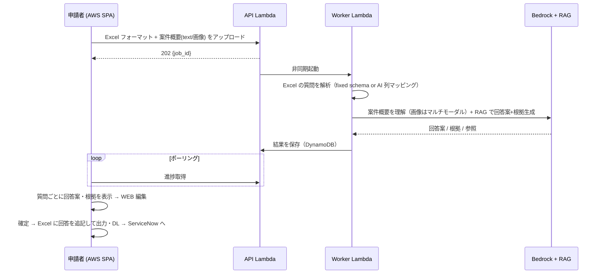

# 入力支援 設計（後続フェーズ）

申請者向けの AWS SPA。Excel フォーマット + 案件概要（テキスト/画像）をアップロードし、質問ごとに AI 回答案 + 根拠を提示。WEB で編集後、Excel に追記して出力する。

## 1. フロー

## 2. 確認支援との共通点・差分

| 項目 | 確認支援 | 入力支援 |
|---|---|---|
| 入口 | ServiceNow REST（ヘッドレス） | AWS SPA |
| 入力 | 回答済み Excel | 質問のみ Excel + 案件概要(text/画像) |
| RAG コア | 共通 | 共通 |
| AI 出力 | 判定 + 返答案 + 根拠 | **回答案** + 根拠 |
| 出力 | 判定列を追記して返却 | 回答列を追記して出力 |
| 編集 | 確認者が ServiceNow 上で | 申請者が SPA 上で |

→ Worker の RAG/Bedrock コアは共有し、プロンプトと出力スキーマだけ差し替える。

## 3. マルチモーダル（案件概要の画像）

- 構成図・画面キャプチャ等を Bedrock（Claude）のマルチモーダル入力で解釈し、回答案生成のコンテキストに含める。
- 画像は S3 に presigned PUT、Worker が参照。

## 4. 画面（SPA）

- `/input-assist/new` — Excel + 案件概要アップロード
- `/input-assist/:jobId` — 質問ごとの回答案・根拠表示 + WEB 編集 + Excel 出力

## 5. 認証

- SPA は Cognito（JWT）。ServiceNow 用 API（APIキー）とは別ルート・別認証。

## 6. ステータス

詳細設計は確認支援（C1〜C5）の基盤が固まった後に着手。本ドキュメントは骨子。
