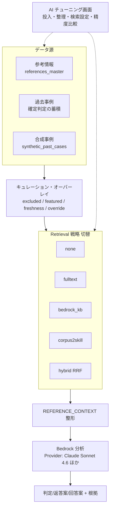

# RAG アーキテクチャ

application-form-poc の RAG 設計を**設計として踏襲**し、コードは新規実装する。確認支援・入力支援の両方がこの共通コアを使う。

## 0. 全体像



## 1. 3 つのデータ源

| データ源 | テーブル/格納 | 投入経路 |
|---|---|---|
| **参考情報** (references) | Aurora `references_master` | 管理画面で手入力 / URL・PDF から AI 取り込み / AI 鮮度更新 |
| **過去事例** (past cases) | Aurora（確認支援の確定判定を蓄積） | 確認支援で確定した判定を蓄積。除外/featured/override でキュレーション |
| **合成事例** (synthetic) | Aurora `synthetic_past_cases` | 管理画面で手作成 / 精度比較の勝者を昇格 |

> application-form-poc では「申請→レビュー→決裁」が AWS 内で完結していたため過去事例が自然に貯まったが、本プロジェクトでは判定の主体が ServiceNow。**過去事例の蓄積方法は要設計**（[未決事項](#9-未決事項) 参照）。当面は参考情報 + 合成事例 + 確認支援結果のフィードバックで構成。

## 2. Retrieval 戦略（切替可能）

`RetrievalStrategy` Protocol で抽象化し、`strategy_id` で切替。精度比較で横並び評価できる。

| strategy_id | 実装 | レイテンシ | コスト | 特徴 |
|---|---|---|---|---|
| `none` | 何も取得しない | 即時 | 0 | 対照（RAG なしの baseline） |
| `fulltext` | Aurora FULLTEXT | <100ms | AWS内のみ | 語彙一致。即反映。**まずこれで開始** |
| `bedrock_kb` | Bedrock Knowledge Bases（OpenSearch Serverless + Titan Embeddings V2） | 数十秒〜分 | OpenSearch ~$170-200/月 | 意味類似に強い |
| `corpus2skill` | 階層ナビゲート（SKILL.md ツリー + Claude tool use） | 1〜2秒 | navigate ~$0.05-0.10/query | 説明可能・vector DB 不要 |
| `hybrid` | bedrock_kb + corpus2skill を RRF 統合 | 3〜8秒 | 上記合算 | 両者の長所 |

```python
@dataclass
class RetrievalQuery:
    question: dict        # {id, text, category, answer}
    keywords: list[str]
    top_k: int = 5

@dataclass
class RetrievedItem:
    kind: str             # "reference" | "past_case" | "synthetic"
    title: str
    summary: str
    source_id: str | None
    score: float
    debug_info: dict

class RetrievalStrategy(Protocol):
    strategy_id: str
    display_name: str
    def retrieve(self, query: RetrievalQuery) -> list[RetrievedItem]: ...
```

### 2.1 corpus2skill（参考実装方針）

ナレッジを階層ツリーに分類し、LLM が tool use で段階的にナビゲートする方式（arXiv 2604.14572「Don't Retrieve, Navigate」）。

- **コンパイル（オフライン）**: 全文書を Titan Embeddings V2 で埋め込み → MiniBatchKMeans でクラスタ化 → Claude が各クラスタを要約 → 再帰（最大 3 層）→ `SKILL.md` / `INDEX.md` を S3 `corpus-skill/v*/` に出力。
- **検索（オンライン）**: ルートから tool use（`load_node` / `get_documents`）で葉に到達 → 本文取得。
- **採用理由**: 本ドメインは「単一ドメイン・アトミック文書」で C2S の強み領域。vector DB 不要の廉価オプションを保持できる。

詳細は application-form-poc の `doc/design/ai/knowledge-base/` および `doc/adr/backend/006,007` を参照。

## 3. キュレーション・オーバーレイ

全戦略の `retrieve()` 出力に共通の後処理を適用（戦略を切り替えてもキュレーション効果が継続）。

- `excluded=true` → 除外
- `featured=true` → スコア +5（教科書事例）
- `freshness=outdated/aging` → スコア -3 / -1
- `override_*` → 本文差し替え（PII 匿名化・typo 修正）
- `curator_note` → プロンプトに注入

## 4. Provider パターン（LLM 切替）

モデル非依存の `PromptSpec` 中間表現を介し、Provider を切替。

| 論理ID | モデル | リージョン | API |
|---|---|---|---|
| `claude-sonnet-4-6`（主軸） | `jp.anthropic.claude-sonnet-4-6`（Cross-Region Inference Profile, 日本処理） | ap-northeast-1 | Converse |
| `gpt-oss-120b` | `openai.gpt-oss-120b-1:0` | ap-northeast-1 | Converse |
| `foundation-sec`（任意） | Foundation-Sec-1.1-8B（Custom Import） | us-east-1 | InvokeModel |

> application-form-poc は Foundation-Sec を主軸にしていたが、本 POC は **Claude Sonnet 4.6 を既定**にする（判定 + 返答案の文章生成品質を重視）。Provider 層は据え置きで他モデルも比較可能。

## 5. プロンプト方針

application-form-poc の知見を踏襲。

- **質問単位分割**（1 問 1 API コール）— 回答混同を防ぎ検出率向上。
- **few-shot 例注入** — ドメイン知識の転写。
- **実リスク焦点** — 「ベストプラクティス違反 = 高リスク」と短絡しない。AES-256 SSE-S3 等は十分とみなす。
- **REFERENCE_CONTEXT 注入** — retrieve 結果を整形してプロンプトに埋め込み。
- **JSON のみ出力** + postprocess でスキーマ検証・カテゴリ正規化。
- 確認支援では出力に **`reply_draft`（返答案）** を追加（確認者が ServiceNow に転記できる文章）。

## 6. PII フィルタ（必須）

ServiceNow から受け取る Excel・案件概要には個人情報が含まれうる。RAG/Bedrock 投入前に必ず通す。

- 検出対象: メール・電話・クレジットカード・マイナンバー・IP・AWS キー・漢字氏名 等。
- Bedrock は AWS 信頼境界内（Anthropic/OpenAI には届かない）だが、ログ・キャッシュ・過去事例蓄積の観点で除去する。

## 7. AWS サービス対応

| 層 | サービス |
|---|---|
| LLM | Bedrock Converse（Claude Sonnet 4.6 主軸 / gpt-oss） |
| Embedding | Bedrock Titan Embeddings V2（corpus2skill / Bedrock KB） |
| Vector | Bedrock Knowledge Bases + OpenSearch Serverless（`bedrock_kb` 戦略時のみ） |
| Storage | Aurora（references/synthetic/評価run）、S3（corpus-skill/v*, Excel, PDF） |
| 外部 | Tavily Web Search（参考情報リフレッシュ補完、任意）|

## 8. 精度比較（AI チューニング画面）

モデル × retrieval 戦略の 2 軸で同一検証セットを評価し、既定値を決める。詳細は [admin-tuning.md](admin-tuning.md)。

## 9. 未決事項

- **過去事例の蓄積経路**: ServiceNow が判定主体のため、確定判定をどう AWS に戻すか（確認支援のレスポンスに確認者の最終判定を後追い POST してもらう / ServiceNow から定期エクスポート 等）を設計する。
- **Excel フォーマットの揺らぎ対応**: 確認支援 POC は規約準拠 Excel 前提で開始。AI 列マッピングは入力支援と共通化して後続で。
- **retrieval 既定戦略**: POC は `fulltext` で開始 → 精度比較を見て `hybrid` 等へ。

## 10. 関連

- [システム全体設計](system-overview.md) / [確認支援設計](confirmation-assistance.md) / [AI チューニング設計](admin-tuning.md)
- [ADR-005 RAG 戦略の踏襲](../adr/005-rag-strategy-reuse.md)
- 母体設計: `../application-form-poc/doc/design/ai/` および `doc/adr/backend/`
