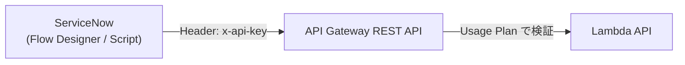
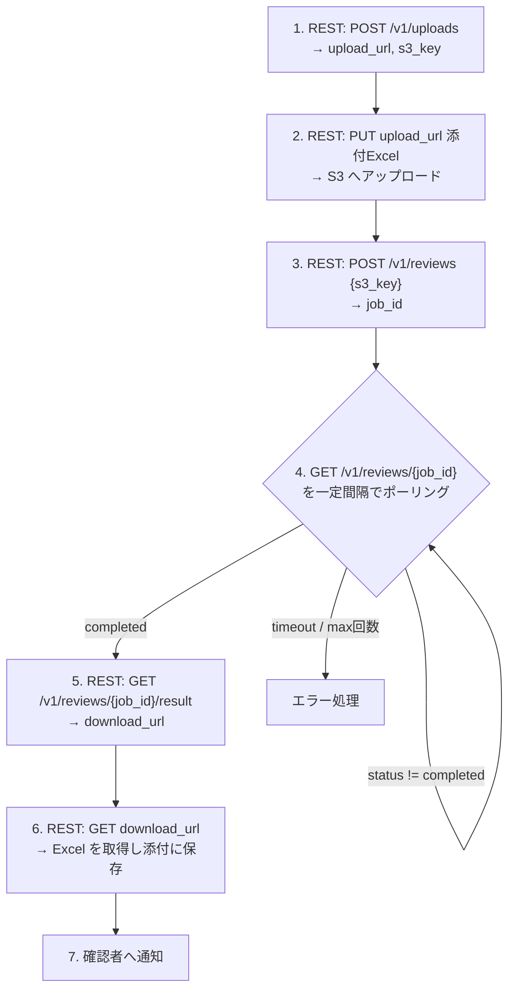
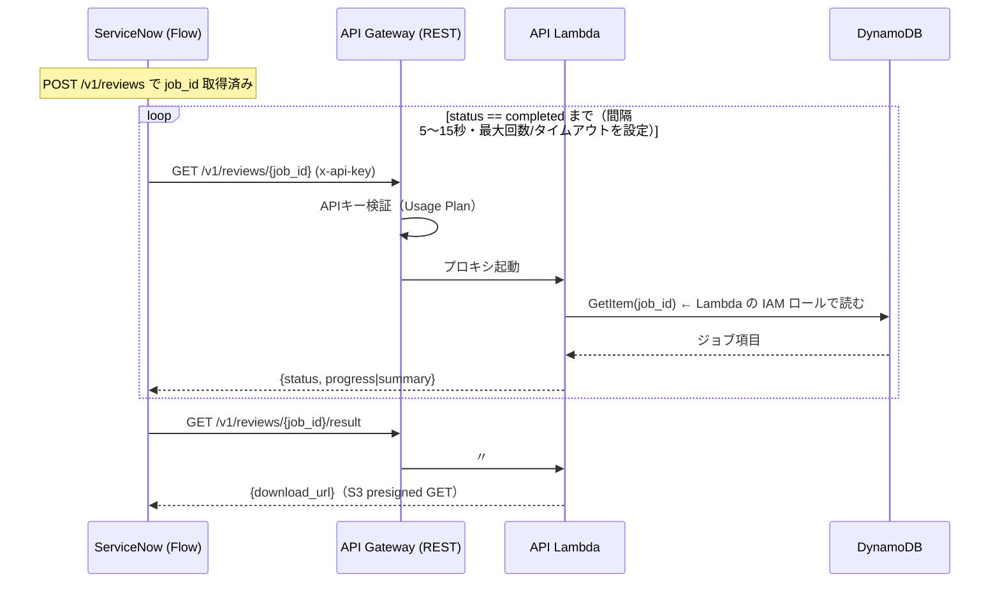

# ServiceNow 連携設計

## 1. 連携方針

- 連携方向: **ServiceNow → AWS（インバウンド主体）**。確認ワークフローのアクションから AWS REST API を呼ぶ。
- 認証: **API Gateway + APIキー**（`x-api-key` ヘッダ）。[ADR-004](../adr/004-api-auth-apikey.md)。
- 処理特性: 1 申請あたり数十問 × Bedrock 呼び出しで **2〜5 分** かかる → API Gateway の 29 秒制限を超える → **非同期ジョブ + ポーリング**。[ADR-003](../adr/003-async-processing.md)。
- Excel 受け渡し: **S3 presigned URL** 経由（API ペイロード上限・画像入り Excel の肥大化を回避）。[ADR-002](../adr/002-excel-exchange-method.md)。

## 2. 認証（APIキー）

- API Gateway に ServiceNow 専用のルート群（`/v1/*`）を用意し、**Usage Plan + API Key** で保護。
- APIキーは Secrets Manager に保管し、ServiceNow 側は **Connection & Credential Alias**（または MID Server の保護されたパラメータ）に登録。
- レート制限・スロットリングを Usage Plan で設定（誤連打・暴走対策）。
- 補足: HTTP API v2 はネイティブの API Key 機能を持たないため、**REST API (API Gateway v1) で `/v1/*` を構成**するか、HTTP API + Lambda Authorizer でキー検証する。POC では実装容易な **REST API の API Key + Usage Plan** を採用（[ADR-004](../adr/004-api-auth-apikey.md) で確定）。



## 3. REST インターフェース（確認支援）

ベースパス: `/v1`

| # | メソッド | パス | 用途 |
|---|---|---|---|
| 1 | POST | `/v1/uploads` | Excel アップロード用 presigned PUT URL を発行 |
| 2 | POST | `/v1/reviews` | 確認支援ジョブを作成（s3_key を渡す）→ `202 { job_id }` |
| 3 | GET | `/v1/reviews/{job_id}` | ジョブ状態取得（ポーリング） |
| 4 | GET | `/v1/reviews/{job_id}/result` | 結果 Excel の presigned GET URL を発行 |

### 3.1 POST /v1/uploads

```jsonc
// request
{ "filename": "application_001.xlsx", "content_type": "application/vnd.openxmlformats-officedocument.spreadsheetml.sheet" }
// response 200
{
  "upload_url": "https://s3...X-Amz-Signature=...",   // 有効期限 15 分の PUT URL
  "s3_key": "reviews/inbound/20260605/uuid.xlsx",
  "expires_in": 900
}
```

ServiceNow は返却された `upload_url` に Excel バイナリを HTTP PUT する。

### 3.2 POST /v1/reviews

```jsonc
// request
{
  "s3_key": "reviews/inbound/20260605/uuid.xlsx",
  "application_meta": {                  // 任意。ServiceNow 側のキー等
    "sn_record_id": "REQ0012345",
    "service_name": "Some SaaS",
    "service_provider": "Vendor Inc."
  },
  "options": {
    "retrieval_strategy_id": "hybrid",   // 省略時は system_settings の既定
    "model_id": "claude-sonnet-4-6"      // 省略時は既定
  }
}
// response 202
{ "job_id": "REV-20260605-abc123", "status": "processing", "poll_url": "/v1/reviews/REV-20260605-abc123" }
```

### 3.3 GET /v1/reviews/{job_id}

```jsonc
// response 200 (処理中)
{ "job_id": "...", "status": "processing", "progress": { "current": 12, "total": 30 } }
// response 200 (完了)
{
  "job_id": "...",
  "status": "completed",
  "summary": { "approved": 22, "conditional": 5, "needs_review": 3, "rejected": 0 },
  "result_available": true
}
// response 200 (失敗)
{ "job_id": "...", "status": "failed", "error": "..." }
```

`status`: `processing` | `completed` | `failed`

### 3.4 GET /v1/reviews/{job_id}/result

```jsonc
// response 200
{
  "download_url": "https://s3...X-Amz-Signature=...",  // 結果 Excel の GET URL（15 分）
  "s3_key": "reviews/outbound/20260605/uuid_reviewed.xlsx",
  "expires_in": 900
}
```

## 4. ServiceNow 側の実装イメージ

確認ワークフロー（Flow Designer）に以下のサブフローを組む。



> ポーリングは ServiceNow の Flow（Wait for condition / スケジュール）で実装する。AWS からの**コールバック（AWS → ServiceNow REST）** も代替案として可能だが、認証経路が増えるため POC ではポーリングを採用（[ADR-003](../adr/003-async-processing.md) 参照）。

## 5. ポーリングの仕組み

**ServiceNow は AWS の内部リソース（DynamoDB / S3）を直接参照しない。** 触れるのは API Gateway（REST + `x-api-key`）だけで、ジョブの完了確認は `GET /v1/reviews/{job_id}` を一定間隔で繰り返すことで行う。



### なぜ DynamoDB を直接見られない（見せない）のか

- DynamoDB の API は **AWS SigV4 署名（IAM 認証）が必須**で、「APIキー付きの公開 REST」のようなアクセス経路を持たない。ServiceNow から直接叩く方法は通常ない。
- 仮に IAM 認証情報を ServiceNow に配るのは権限分離・運用（ローテーション・最小権限）の観点で不可。
- よって **REST API（API Gateway + API Lambda）をファサード**にし、DynamoDB はサーバ側（Lambda の IAM ロール）でのみ読む。ServiceNow には `status` 等の必要項目だけを返す。

### ポーリングの実装・コスト

- `GET` は DynamoDB の GetItem 1 回だけで即応答（API Gateway の 29 秒制限には当たらない）。各ポーリングは独立・安価。
- ServiceNow 側は Flow Designer の「Do … Until」ループ + Wait（待機）か、Scheduled Flow で実装。最大試行回数・全体タイムアウトを必ず設定する。
- ジョブの `ttl`（7日）は処理中には影響しない（完了後の自動清掃用）。

### 代替案: コールバック（push）— 現状は不採用

完了時に **AWS → ServiceNow** の Inbound REST（Table API / Scripted REST API）を叩いて通知する方式も可能。リアルタイム性は高いが、AWS→ServiceNow 方向の受け口と認証情報を AWS 側に持たせる必要があり経路が増える。POC ではポーリングを採用（[ADR-001](../adr/001-servicenow-integration-pattern.md) / [ADR-003](../adr/003-async-processing.md)）。将来オプション。

## 6. Excel フォーマット規約

確認支援が機能するため、Excel に最低限の構造規約を設ける。詳細は [confirmation-assistance.md](confirmation-assistance.md#excel-フォーマット規約)。

- 質問 ID 列・質問文列・回答列が機械的に特定できること（ヘッダ行 or 設定で指定）。
- AI が追記する列（判定 / 返答案 / 根拠 / 参照）は出力時に付与し、入力時には不要。

## 7. セキュリティ留意点

- ServiceNow が送る Excel には**個人情報・社外秘**が含まれうる。RAG/Bedrock 投入前に **PII フィルタ**を必ず通す（漢字氏名・メール・電話・マイナンバー・AWS キー等）。
- presigned URL は短命（15 分）・1 回利用想定。S3 はバケットポリシーで直接公開しない。
- APIキーは Secrets Manager 管理、ローテーション手順を用意。
- CloudWatch Logs に Excel 本文・PII を出力しない（redact）。

## 8. 関連

- [ADR-001 ServiceNow 連携パターン](../adr/001-servicenow-integration-pattern.md)
- [ADR-002 Excel 受け渡し方式](../adr/002-excel-exchange-method.md)
- [ADR-003 非同期処理方式](../adr/003-async-processing.md)
- [ADR-004 API 認証（APIキー）](../adr/004-api-auth-apikey.md)
