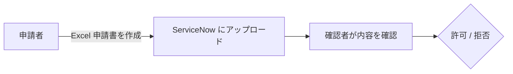
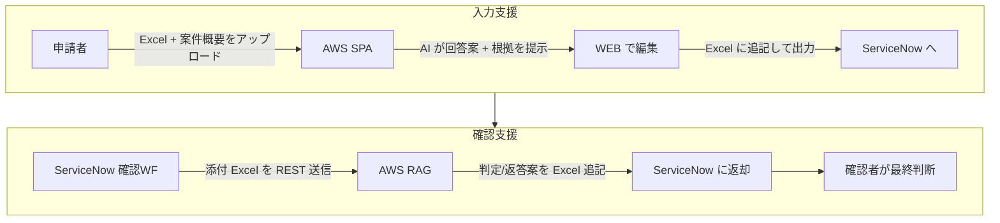
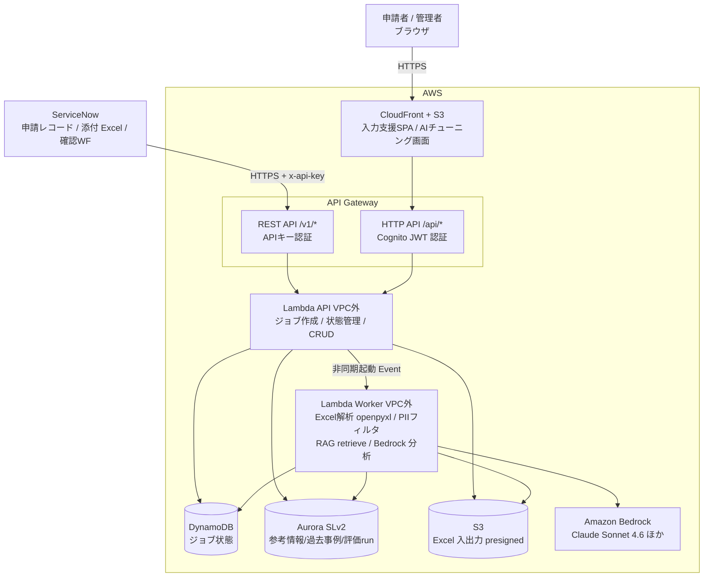
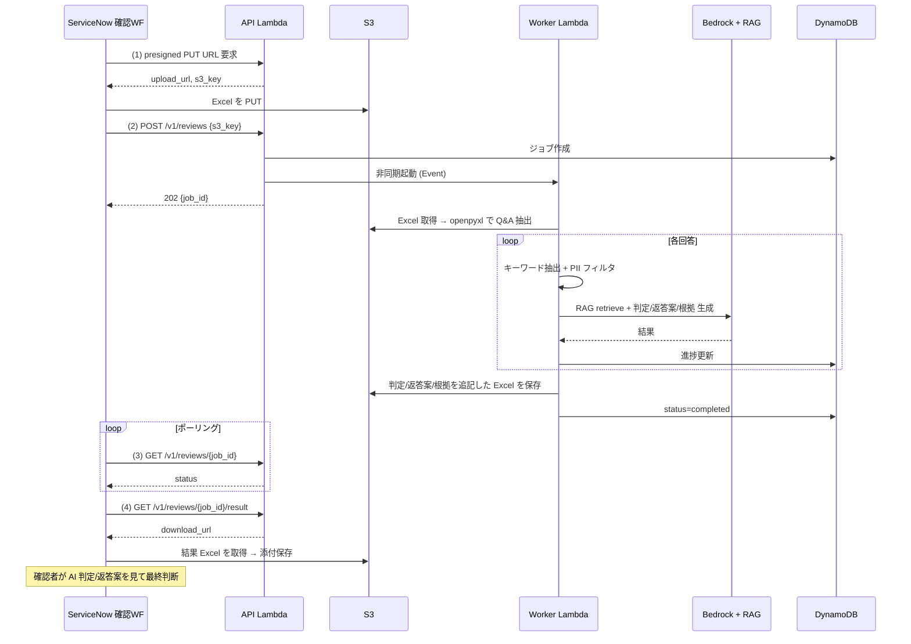
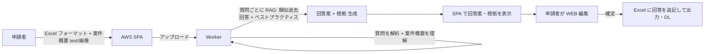
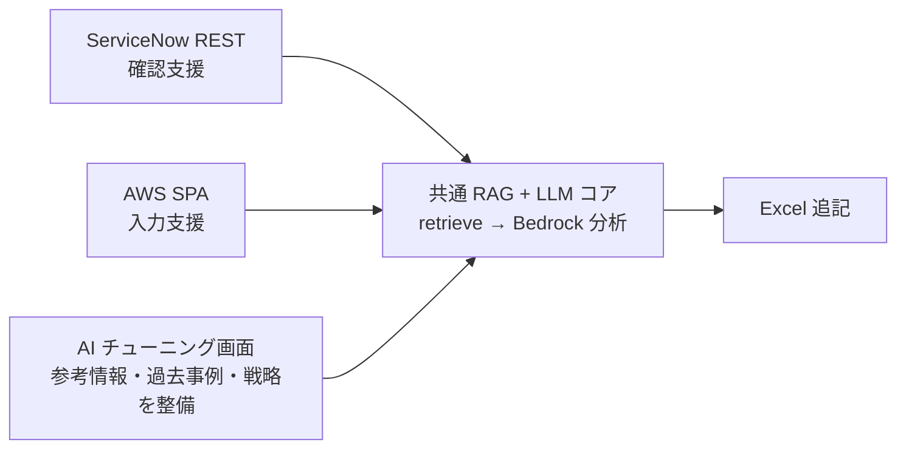

# システム全体設計

## 1. 目的とスコープ

クラウド利用可否申請業務において、申請者（入力）と確認者（判定）双方の負担を AI で削減する。
業務ワークフローの**主体は ServiceNow**であり、AWS は AI 処理に特化したコンポーネント群を提供する。

### 1.1 現行業務（AS-IS）

### 1.2 AI 支援後（TO-BE）

## 2. スコープ境界

| 領域 | 主体 | AWS の責務 |
|---|---|---|
| 申請レコード・添付管理・承認状態 | ServiceNow | — |
| 確認ワークフロー（人の判定） | ServiceNow | — |
| **確認支援**（回答の RAG チェック・判定/返答案生成・Excel 追記） | ServiceNow がトリガ | REST API + RAG（**ヘッドレス**、画面なし） |
| **入力支援**（Excel 解析・回答案提示・WEB 編集・Excel 出力） | AWS | SPA（フロント）+ API + RAG |
| **AI チューニング**（RAG/corpus2skill 編集・参考情報整備・精度比較） | AWS | SPA（管理画面）+ API |

> **重要**: 確認支援は「画面」を AWS に持たない。ServiceNow の確認ワークフローが REST で AWS を呼び、結果の Excel を受け取る。AWS 上に作る**画面は「入力支援 SPA」と「AI チューニング画面」のみ**。

## 3. 全体構成図

## 4. 主要データフロー

### 4.1 確認支援（最優先）

詳細は [confirmation-assistance.md](confirmation-assistance.md)。

### 4.2 入力支援（後続）

詳細は [input-assistance.md](input-assistance.md)。

## 5. 共通基盤（確認支援・入力支援で共有）

両機能は同じ RAG 基盤と Excel 処理を共有する。差分は「入口（REST か SPA か）」と「出力（判定/返答案 か 回答案 か）」のみ。

詳細は [rag-architecture.md](rag-architecture.md)。

## 6. 関連ドキュメント

- [ServiceNow 連携設計](servicenow-integration.md)
- [確認支援設計](confirmation-assistance.md)
- [RAG アーキテクチャ](rag-architecture.md)
- [インフラ設計](infrastructure.md)
- [ADR 一覧](../adr/)
- [ロードマップ](../roadmap.md)
